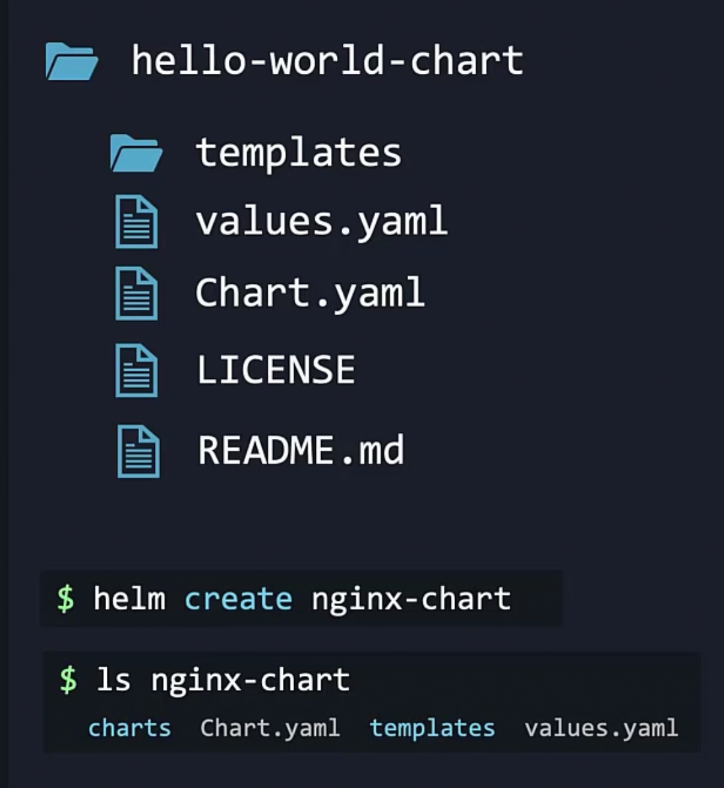
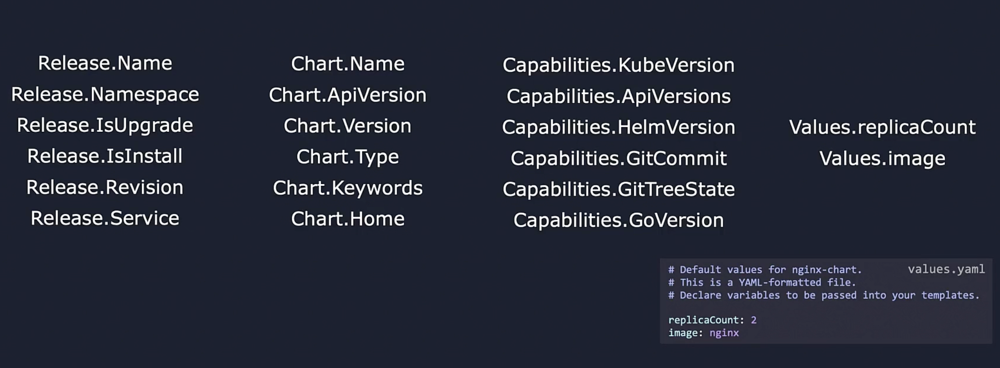
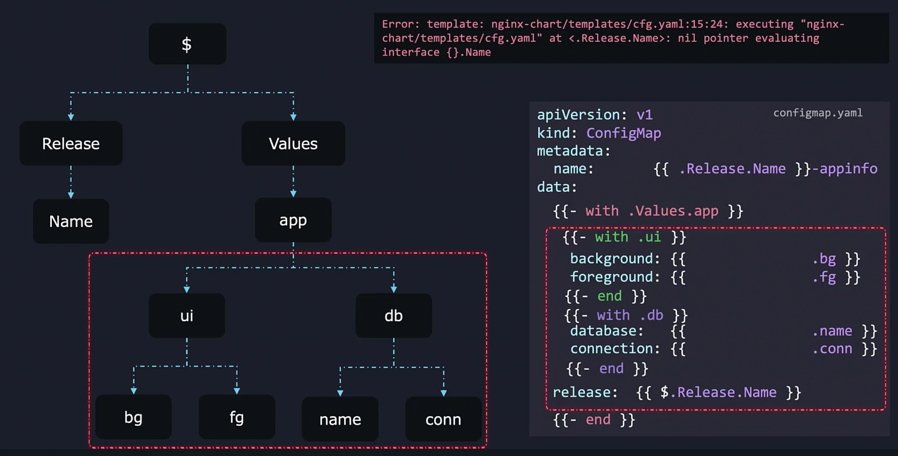
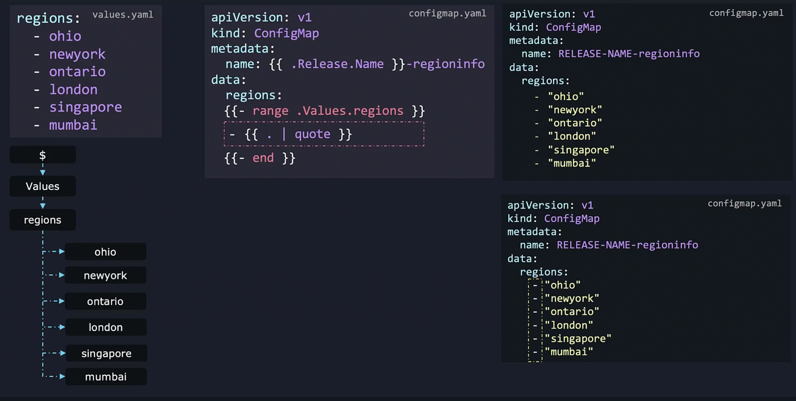
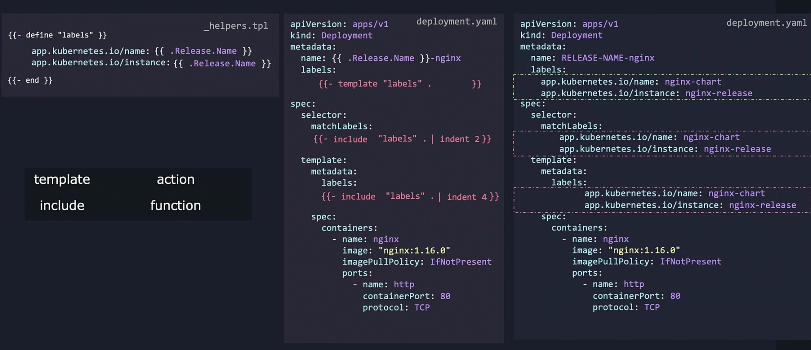
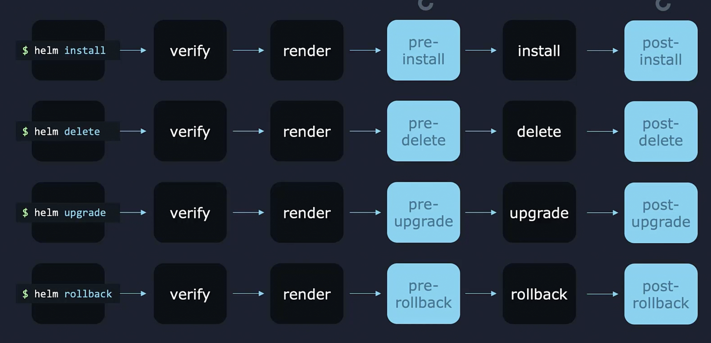
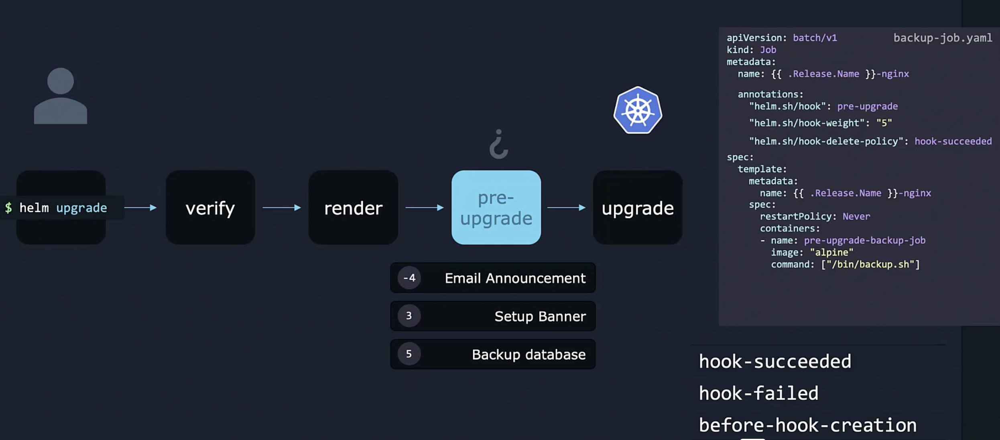

# Helm - package manager for Kubernetes

- `helm install --values custom-values.yaml my-release bitnami/wordpress` - install wordpress image with variables in custom-values.yaml
- updating the variables in the image
    - `helm pull --untar bitnami/wordpress`
    - `ls wordpress`
    - update the value.yml in the directory
    - `helm install my-release ./wordpress`
- creating a helm chart
    - `helm create nginx-chart` create a folder with helm strucutre 
    
    - helm chart example
    ```yml
    {{ .Release.Name }}-nginx #curly brackets are the Go Template Language. It takes value deployment-name-1 from command helm install deployement-name-1 ./helm-chart-name; The Dot in front of Release means it takes Release value from the root/top level.     
    ```
- create a deployment with a helm chart
    - `helm install deployement-name-1 ./helm-chart-name`
- objects

    
- linting to check typos and formattings in templates 
    - `helm lint ./nginx-chart`
- template command to show the complete deployment, service yaml files with user defined values 
    - `helm template ./nginx-chart`
    - `helm template ./nginx-chart -debug` - to show the generated yml file for debugging
- dry run install
    - `helm install hello-world-1 ./nginx-chart --dry-run`
- functions
    - `{{ quote .Values.image.repository}}` add quotes around the value image.repository in value.yaml
    - `{{ default "nginx" .Values.image.repository}}` default the image.repository value to nginx if it does not shown in values.yaml
- pipelines
    - `{{ .Values.image.repository | upper | quote | shuffle}}` uppercase the value of image.repository and then add quotes around the value. Shuffle the string finally. 
- use with to set up scope: $ to reference back to root level
    
- range: `{{ . | quote }}` to loop through the list region and prints out the regions in data.regions in configmap.yml; use `-` at the begining of `{{}}` to remove emtpy lines generated in configmap.yml when the list is empty. 
    
- template
    - use common label values defined in tpl file for deployment.yml
    - the template file name should start with `_` otherwise it will be considered as k8 manifest file
    - use include and indent to add indentiation
    
- chart hooks
    - types of hooks
    
    - hook example
    
- package and upload the chart
    - `helm package ./nginx-chart`
    - sign the package 
        - `gpg --full-generate-key "key name" ` - generatre key
        - `gpg --export-secretkeys >~/.gnupg/secring.gpg` - export key
        - `helm package -sign --key "key name" --keyring ~/.gnupg/secring.gpg ./nginx-chart` - sign the package with the key
        - `helm verify ./nginx-chart-0.1.0.tgz` - verify the integrity of the package
        - `helm repo add our-charts https://helm-charts-repo-link` add the new repo
        - `helm repo list`
        - `helm install my-new-release our-charts/nginx-chart`


