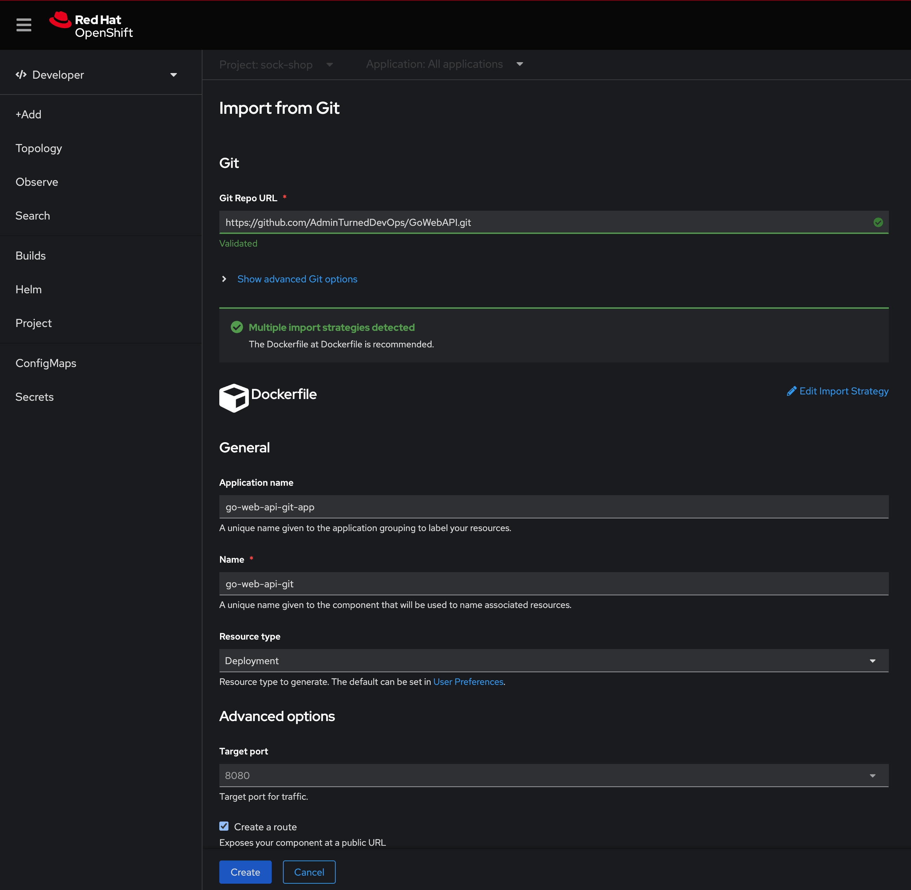
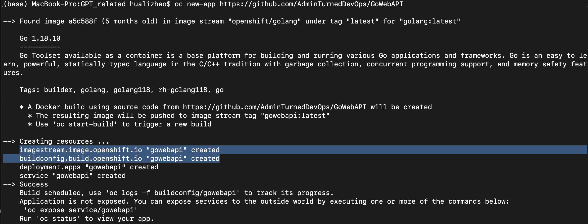
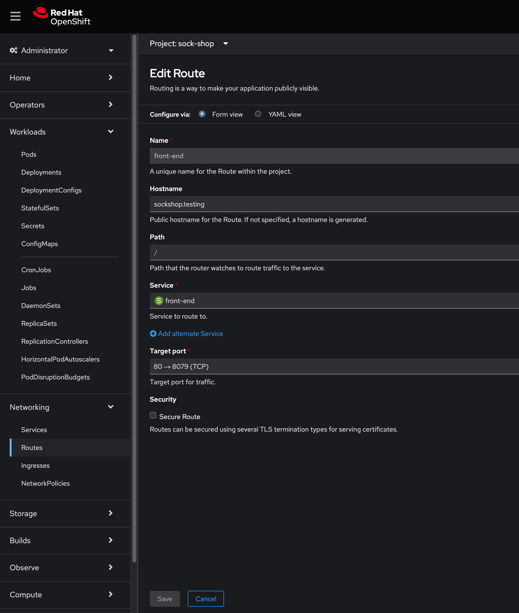
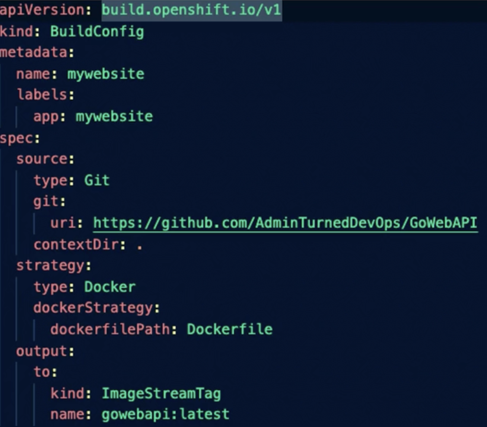
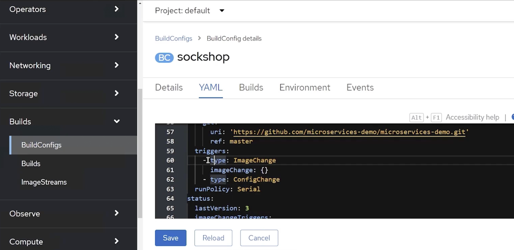

# OpenShift starter

## Installation
CRC installation: console.redhat.com/openshift/
- create a cluster from Local tab on the page
- Install crc
- `crc setup` - setup virtuallizaiton with HyperV
- `crc delete`
- `crc start`
- `crc console` - to view the web console
- `crc console --credentials`


## Sample project for play
sock shop: https://github.com/mosuke5/microservices-demo-openshift
- `oc apply -f ./complete-demo.yml`

## Auth
- `oc login -u system:admin`
- `oc get projects`
- `oc get users`

## Concepts and commands 
- Build from git:

- Image Stream: allows you to update deployments on the fly with tags
    - It does the following:
        - checks registry for image updates
        - notifys the updates 
        - rolling update your image 
        - update manifest automatically 
    - `oc new-app --image-stream=sock-shop/carts:0.4.8` creates a deployment with ImageStream. name_space=sock-shop, image_stream_name=carts, image_version=0.4.8
    - yaml for creating an image stream under Administrator-Builds-ImageStreams
        ```yml
        kind: ImageStream
        metadata:
        name: carts
        spec:
        lookupPolicy:
            local: false
        tags:
        - name: "0.4.8"
            from:
            kind: DockerImage
            name: weaveworksdemos/carts:0.4.8
            referencePolicy:
            type: Source
        ```
- BuildConfig: defines the process from source code to a container
    - yaml for creating a build config
        ```yml
        apiVersion: build.openshift.io/v1
        kind: BuildConfig
        metadata:
        namespace: sock-shop
        name: sockshop-build-config
        spec: 
        source:
            git:
            ref: master
            uri: 'https://github.com/mosuke5/microservices-demo-openshift.git'
            type: Git
        strategy:
            type: Source
            sourceStrategy:
            # Below from section defines which container image we are use to create this build config
            from:
                kind: ImageStreamTag
                name: 'ruby: 2.7'
                namespace: openshift
            env: []
        triggers:
            - type: ImageChange
            imageChange: {}
            - type: ConfigChange
        ```
    - `oc new-app [git link]` creates image stream and build config for the git project
    
    - `oc start-build sockshop` creates a new build of sockshop
- Route: 
    
- Build Strategies: 
    - source to image: source code -> docker image 
    - pipeline: Jenkins pipeline; Openshift manages the jenkins file
    - docker: like the docker build; requires a docker file in the same repo of the code
    - custom: docker image with build logic 
- Build Input: 
    - Git
    - Dockerfile 
    - Binary - jars etc
    - Image 
    - Input secrets
    - external artifacts - recommended way to store binaries 
- Docker Build: 
    - buildah: A tool that creates container images out of the box that in OCT complaint fashion
        - OCI compliants - open container initiatives 
    - below yml create a docker image with the docker file lives in the git link

        
    - example: below yml builds a container image using the Dockerfile. The resulting container image is pushed to ImageStream 
        ```yml
        apiVersion: build.openshift.io/v1
        kind: BuildConfig
        metadata:
        namespace: sock-shop
        name: mywebsite
        labels:
            app: mywebsite
        spec: 
        source: 
            type: Git
            git:
            uri: https://github.com/AdminTurnedDevOps/GoWebAPI
            contextDir: .
        # Build a container image using the Dockerfile found at the root of that repository.
        strategy:
            type: Docker
            dockerStrategy: 
            dockerfilePath: Dockerfile
        # Push the resulting container image to an ImageStream named gowebapi with the tag latest in the sock-shop namespace
        output:
            to:
            kind: ImageStreamTag
            name: gowebapi:latest
        ```
- S2I: 
    - builds source code to a docker images without docker files
    - upload the image to docker registry 
    - manages security so only certain ppl can build the docker image 
- Build Triggers
    - Webhook: Send request to Openshift API to trigger a build when something changes in Git, BitBucket
    - Image Change: triggers a build when image changes
    - Configuration Change: Pod template change -> creates new replication controller 

        


